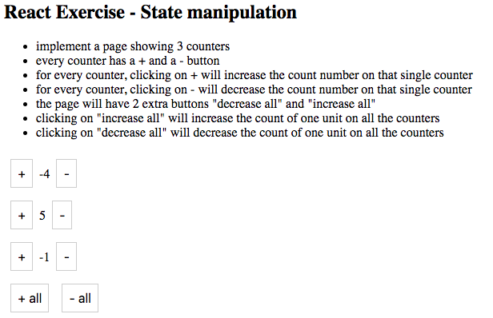

# Lifting State Exercise

_Introduction_

In this lab we'll be building a simple group of counters that can increment and decrement, in addition to a button that can increment all of the counters.  You will get practice lifting state and triggering state changes in a parent component from a child component.

## A Spec!

## A Few Reminders

Before starting take a second to recall the core tasks of lifting state:

- Write a method that will perform an action as a result of some event triggered from the child component
- Bind the method with `this`
- Write a child component that takes a function as a prop that it can call when some event is fired
- Maybe add a prop to the child component with some piece of data
- Don't mutate state directly; use `setState` and avoid mutating data in a component's state.

Also before starting, try to map out the flow of the data in this sample app.  What components are needed?  What props will they take?  How will state be managed?

## Getting Started

- Fork and clone this repo
- `cd` into the repo
- run `npm init react-app counter`
- `cd` into `counter`
- start up the app

## The App Componet

Start off by building the app component with the state needed for the three counters.  Start thinking about how to write methods to increment each individual counter but don't worry about implementing them yet.

## The Counter Component

Next, write a `Counter` component.  It should take a prop representing the number it will display as well as `onIncrement` and `onDecrement` props for triggering state changes in the parent. 

For now, just render the value prop in the component.  

`import` `Counter` from the `App` component and render it one time, passing one of the state values stored in App.  At this point, the `Counter` component should display the prop it was passed.

## OnIncrement

Now it's time to change the value passed to counter.  Add a button to the `Counter` component that will increase its value by 1.  The button should call the `onIncrement` method passed to `Counter` as a prop.  

Remember, the idea is for the child to send a message to the parent to change a piece of state, the parent will make the change, and then send a new value as a prop to the child.

Now, go back to the `App` component and write a `handleIncrement` method that increases the one value in the App's state by 1.  `bind` this method and pass it as a prop to the `Counter`.

If all goes well, you should be able to click the button and see the value of the number for that counter increase by 1.

## OnDecrement

Rinse and repeat for `onDecrement` but this time subtract the value by 1.

## More Counters

At this point, it's time to just copy + paste our `Counter` twice inside the render method of the `App` component.  You should have three `Counter` components rendering, each with their own values and inc/dec buttons.  Take care that clicking on one Counter's buttons should not change the values of the other counters.

## All The Values

To wrap up, write `IncreaseAll` and `DecreaseAll` methods and buttons for each method in the `App` component.  Clicking these buttons should update every value displayed in our `Counter` components.

## Win
