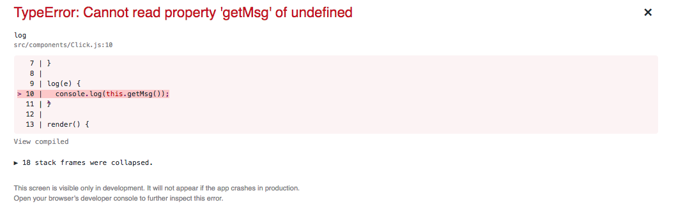

# Events and Lifting State
_Introduction_
In this lesson, we'll cover how to allow React components to share data and event-driven behavior with each other.

## SWBAT

- attach a click event listener to a react component
- use bind and/or arrow functions to preserve the `this` context in a function passed as a prop
- Lift state out of a component into its parent
- comfortably navigate both helper methods on a class component and props passed to a child component

## Helper Methods Review
Recall that functionally oriented code is a guiding aim for React apps.  With the help of jsx, we can start to think about sections of the view in terms of returning a concrete value from a function or method, e.g., the `render` method simply returns a single jsx element perhaps with children components nested inside of it.  `render` is a special method that React calls for us, but inside of `render` we can call other functions we write that also return either concrete js data structures or bits of jsx.

Check out the pokemon demo in this repo for a few examples of using helper methods in a class component for handling small bits of the view.

```javascript
class App extends Component {
  // other method definitions
	
  title() {
    return <h1>Hello World</h1>;
  }

  render() {
    return (
      <div className="App">
        {this.title()}
        {this.renderFinalConsonantPoke()}
        {this.renderVowelPoke()}
      </div>
    );
  }
```

Recall that `this` is required for this examples since the methods are defined _on the class_ and are not free-floating functions.

For a bonus challenge, try to adjust the code in `App.js` so that `title` is a function defined outside the class.  Adjust the `render` method accordingly.

<details>
  <summary>Bonus Solution:</summary>
  
```js
...

const title = () => {
  return <h1>Hello World</h1>;
}

class App extends Component {
  render() {
    return (
      <div className="App">
        {title()}
      </div>
    );
  }
}

...
```
</details>

## A Click Event

React "wraps" the native dom events that are triggered by the browser in its own synthetic events.  Rather than manually attaching event listeners, React enables developers to listen for events by passing props to special attributes on React elements.

One such special attribute is `onClick`.  You can pass a function as a prop to `onClick` and that function will be called whenever a user clicks on the target element. _Hello, callback._

The component below is a very simple illustration of passing a function, by name, as a prop to `onClick`.  Notice that pure functional components are easily strung together to implement small bits of behavior or rendering logic.

```javascript
import React from 'react';

function log(e) {
  console.log('I got clicked!');
}

export default function Click(props) {
  return (
    <div>
      <button onClick={log}>Log the Click!</button>
    </div>
  )
};
```

### But there's trouble on the horizon

We could accomplish the same task using a class component:

<strong> /!\ Warning: Don't actually do this.  We will go over why shortly /!\ </strong>


```javascript
import React, { Component } from 'react';

export default class Click extends Component {

  log(e) {
    console.log('I got clicked again!');
  }

  render() {
    return (
      <div>
        <button onClick={this.log}>Log the Click!</button>
      </div>
    );
  }
}
```

While the above may seem innocuous, there lies a subtle bug in the making that can be quite tricky to notice.  The problem lies in how `this` is handled when passing a function as a value.  When `this.log` is passed to the `onClick` property and gets called when the button is clicked, the `this` context is lost from within `log`.  Since we don't use `this` inside the `log` function there's no trouble, but if we did then we get a sad panda:

the following code yields the error below when the button is clicked.

```javascript
import React, { Component } from 'react';

export default class Click extends Component {

  getMsg() {
    return 'I got clicked again!';
  }

  log(e) {
    console.log(this.getMsg());
  }

  render() {
    return (
      <div>
        <button onClick={this.log}>Log the Click!</button>
      </div>
    );
  }
}
```



> In JavaScript, class methods are *not bound* by default. If you forget to bind *this.log* and pass it to `onClick`, this will be `undefined` when the function is actually called.

Fortunately, we can bind our `this` using a few different tricks. Since the logic for when `this` is needed can be erratic, try to obey the following rule:

#### When passing a function as a prop _always_ bind `this` regardless of whether or not it is used in the function.

## Restoring Our Future with `this`

Now, let's look at two different approaches to solving the problem of the missing `this` when passing functions as props.  First, we'll work through `bind` which is the older, more traditional strategy for manually attaching a `this` context to a function.

Second, we'll go over the ES6 version using arrow functions.  There are trade-offs with either approach.  The `bind` strategy could be seen as more rigid and structured so it's easier to verify in one place that all relevant functions have been adequately handled.  On the other hand, the ES6 approach using arrow functions extends the possible behavior of the pattern in ways we'll need later.  

Which version you use isn't nearly important as being able to confidently handle the problem and efficiently verify that the code you are writing at least follows one approach.

### The bound `this`

The problem of the missing `this` has been around since the earliest days of JavaScript; it arises out of the overlap between passing functions as first-class values, a flexible system for sharing pieces of functionality across different object (or prototype) contexts, and the semantics in JavaScript concerning how functions are invoked.  We've seen one way to "call" or "execute" a function in JavaScript, via `getMsg()`; this way is not unique.  `call` and `apply` will also call a javascript function with some added behavior.  

```js
function greeter() {
  console.log('why, hello there');
}

// the direct method of invocation
greeter();

// in this instance, the behavior is identical
// to the above
greeter.call();

// this is also the same
// there are important differences
// between call and apply but we won't
// delve into them here
greeter.apply();
```

There is a third function, `bind` that doesn't call a function directly but _wraps_ it in another function and returns the wrapped function.

```javascript
const boundGreeter = greeter.bind();
```

We can then call `boundGreeter` and get the same behavior as with `greeter`

```
boundGreeter();
// => logs 'why hello there' to the console
```

Why all the fuss just to get the same behavior?  While this surface functionality is the same, the manner in which `this` operates varies throughout these examples.

Let's wrap `greeter` in a class and see what happens.


```
class Greeter {
  greet() {
    console.log('why hello there');
  }
}

const g = new Greeter();
g.greet();
```

Nothing has really changed here aside from having to instantiate a `Greeter` object.  What happens if we start using `this` in our function?

```
class Greeter {

  buildMsg(name) {
    return `why hello there ${name}`
  }
  
  greet() {
    const name = this.name;
    const msg = this.buildMsg(name);
    console.log(msg);
  }

  setName(name) {
    this.name = name;
  }
}

const g = new Greeter();
g.setName('Soleil');
g.greet(); // logs "why hello there soleil" to the console
```

And then what happens if we "detach" `greet` by assigning it to a variable?

```
const g = new Greeter();
g.setName('Soleil');

const detachedGreet = g.greet;
detachedGreet();
```

```bash
/Users/wagnerizing/code/ga_stuff/octonion/lessons/lifting-state/function-fun/script.js:7
    const name = this.name;
                      ^

TypeError: Cannot read property 'name' of undefined
    at greet (/Users/wagnerizing/code/ga_stuff/octonion/lessons/lifting-state/function-fun/script.js:7:23)
    at Object.<anonymous> (/Users/wagnerizing/code/ga_stuff/octonion/lessons/lifting-state/function-fun/script.js:21:1)
    at Module._compile (module.js:652:30)
    at Object.Module._extensions..js (module.js:663:10)
    at Module.load (module.js:565:32)
    at tryModuleLoad (module.js:505:12)
    at Function.Module._load (module.js:497:3)
    at Function.Module.runMain (module.js:693:10)
    at startup (bootstrap_node.js:191:16)
    at bootstrap_node.js:612:3

shell returned 1
```

sad panda.

This example is similar to the "problematic" class component example above.  Before we solve our original problem, let's play with `bind` to see how javascript allows us to alter the way `this` is handled inside a function.


```
const soleil = new Greeter();
soleil.setName('Soleil');

const kendrick = new Greeter();
kendrick.setName('Kendrick');

soleil.greet(); // logs 'why hello there Soleil' to the console
kendrick.greet(); // logs 'why hello there Kendrick' to the console
```

We can "hijack" the `this` of a function using `bind`.

```
const soleil = new Greeter();
soleil.setName('Soleil');

const kendrick = new Greeter();
kendrick.setName('Kendrick');

const boundGreet = soleil.greet.bind(kendrick);
boundGreet(); // logs 'why hello there Kendrick' to the console
```

`bind` effectively lets us call a function that is "attached" to one object and swap out what `this` refers to and point it to whatever we want, via the object passed as the first argument to `bind`.  Soleil's `greet` function was bound to the Kendrick object, and therefore `this` _from soleil's greet function_ referred to Kendrick from within the bound function.  Note, this has no effect on soleil's `greet` function, it can still be used as normal:

```javascript
soleil.greet();
```

We can leverage `bind` to save `this` when assigning a function to a variable:

```
const boundGreet = soleil.greet.bind(soleil);
boundGreet(); // this is ok and logs a message to soleil

const detachedGreet = soleil.greet;
detachedGreet(); // this throws an error since `this` is lost
```

> This is not React-specific behavior; it is a part of how functions work in JavaScript. Generally, if you refer to a method without `()` after it, such as `onClick={this.handleClick}`, you should bind that method.

## Binding in React
Let's return to the click handler in React from above and resolve our problem by `binding` the function we pass as a prop to `onClick`.

As we just saw, `this` can be preserved in a function passed as a value by first calling `bind` and passing an object as an argument that will be what `this` refers to when the bound function is called.  In this(!) case, we'll just pass `this` as an argumnet to bind to preserve the appropriate reference to the class instance calling the function.

```javascript
import React, { Component } from 'react';

export default class Click extends Component {

  constructor() {
    super();
    this.log = this.log.bind(this);
  }

  getMsg() {
    return 'I got clicked again!';
  }

  log(e) {
    console.log(this.getMsg());
  }

  render() {
    return (
      <div>
        <button onClick={this.log}>Log the Click!</button>
      </div>
    );
  }
}
```

The only difference here is that a `constructor` function has been added where `this.log` is bound to `this`.  In the constructor, `this` refers to the concrete instance of the `Click` component, so when `log` is passed as a prop, it carries a bound `this` context along with it.

These sorts of examples may seem abstract and hard to wrap your head around; fortunately, they are one of a few small such cases and once you get some practice using `bind` they start to feel more natural.

### Hackety Hack Mini-Exercise
- Create a `scratch.js` file
- Define a MusicArtist class with a a constructor that takes a lyric sung by the artist as an argument and stores it as a `lyric` property on `this`
- Add a `play` method that `console.log`'s out the lyric
- Instantiate two artists with appropriate lyrics
- Call `play` on each object
- Now use `bind` to assign the `play` method of each object to another variable and call the bound method.  Be sure to pass in the appropriate object as an argument to `bind`

---

## Arrow Functions

As we've just seen, when functions are passed as values or call `bind`, they lose their original `this` context.  Arrow functions are different.  They do not possess their own `this`, and try to "grab" a this from the surrounding environment.

Using the `Click` example, we can get around the need to explicitly `bind` the `log` function by wrapping it in an arrow function.

```
import React, { Component } from 'react';

export default class Click extends Component {

  getMsg() {
    return 'I got clicked again!!';
  }

  log(e) {
    console.log(this.getMsg());
  }

  render() {
    return (
      <div>
        <button onClick={() => this.log()}>Log the Click!</button>
      </div>
    );
  }
}
```

And what if we want to pass arguments to the wrapped arrow function?  We can accomplish something similar to the `bind` example:

```
import React, { Component } from 'react';

export default class Click extends Component {
  
  getMsg(name) {
    return `I got clicked again by ${name}!`;
  }

  log(name) {
    console.log(this.getMsg(name));
  }

  render() {
    return (
      <div>
        <button onClick={() => this.log('kendrick')}>Log the Click!</button>
      </div>
    );
  }
}
```

This pattern will be quite useful when iterating over a collection of items and passing small pieces of data to event handlers or other functions that need specific behavior for each item in the collection.

For example, imagine `render`ing a list of Users and you want to include a button next to each user's name that will send the associated user a Welcome email when the button is clicked.  You could write a single `sendEmail` function that gets passed a single user as an argument, and then write an arrow function that receives each user in the iteration as an argument.

Voilà

```javascript
import React from 'react';

const users = [
  'kendrick',
  'soleil',
  'celeste',
  'derick',
  'daniel'
];

function sendWelcomeEmail(name) {
  console.log(`sending email to ${name}`)
}

export default props => (
  <div>
    <h1>Welcome New Users</h1>
    {users.map(user => (
      <div key={user}>
        {user} <button
          onClick={() => sendWelcomeEmail(user)}
        >Send Email</button>
      </div>
    ))}
  </div>
);
```

### Hackety Hack Mini Lab
First, take a moment to review the section "Using State Correctly" from the [react docs](https://reactjs.org/docs/state-and-lifecycle.html)

- in a scratch directory **make a new react app** with `create-react-app`
- Clear out the render method of `App.js` and add a simple `h1` with a title message
- in a `constructor` method initialize a state variable `randNum` and set it 0
- Add a genRandom method that generates a random number from 1-10 using `Math.random` and updates the `randNum` state variable with the newly generated value.
- In the `render` method add a button with an `onClick` prop that calls `genRandom` when clicked.  Remember to either `bind` `genRandom` or wrap it in. an arrow function
- Finally, render `randNum` inside `render`

### A Quick Summary

There is a very minor performance penalty when using arrow functions to preserve a `this` context in this way, but in the vast majority of cases the difference is impossible to detect.  The other disadvantage to using arrow functions is now it is difficult to verify that all functions that are being passed as props have been adequately wrapped or handled.  The approach with `bind` presents a nice way to quickly review what functions are passed as props and which are not.

To wit, the functional need to bind or wrap methods in arrow functions is only present when `this` is used inside the method being passed as a prop; still, try to always use one of these two approaches since the result is safer, more robust code and usually a bit more explicit when implying the way in which such methods will be used.

---

## Lifting State

The `onClick` example above is an embyonic version of a concept known as `lifting state` in React.  Part of the widespread appeal of FrontEnd frameworks such as React is the disciplined and organized approaches these frameworks take towards managing the state of an application.  Historically, managing data and its visible representation in a ui has been a very tangled problem.  

React's highly opinionated strategy for managing state focuses on storing as much state as possible in one place and then "passing down" small pieces of state to components that render the stateful data in the ui.  If these child component want to update state or make any changes, they receive special functions from whatever component "owns" the state that they can call in order to update stateful data in the centrally managed piece of the app where state is stored.  Passing a function as a prop to an event handler mimics this approach insofar as the parent component defines some state and then passes a function as a prop to a child component that can then make updates to the parent's state in a controlled manner.  This particular approach is sometimes called React's "unidirectional dataflow".

It is not uncommon to pass a function as a prop down through several layers of nested components before it is finally called.  The additional overhead of defining functions to update state in a single place and then passing them as a prop, hopefully, is justified by the more explicit pathways through which state is both shared across components and updated.

Consider the `Counter` example that illustrates how to call a function passed as a prop:

```js
import React, { Component } from 'react';

export default class Counter extends Component {
  constructor()  {
    super();
    this.state = {
      ctr: 0
    }
  }

  increment() {
    this.setState(state => ({ctr: state.ctr + 1}));
    this.props.onChange();
  }

  decrement() {
    this.setState(state => ({ctr: state.ctr - 1}));
    this.props.onChange();
  }

  render() {
    return (
      <div>
        <button onClick={() => this.decrement()}>Decrement</button>
        {this.state.ctr}
        <button onClick={() => this.increment()}>Increment</button>
      </div>
    );
  }
}
```
The temperature calculator example from [the docs](https://reactjs.org/docs/lifting-state-up.html) is fantastic.  Read it.

#### We Do: Shopping Cart ####

For this exercise we will walk through how to lift state up from a component.

- Lifting State [Shopping Products Lab](https://git.generalassemb.ly/sei-nyc-jeopardy/lifting-state/tree/master/products_app)

### Bringing it All Together

#### You Do: Counter Lab ####

Use the [React Docs](https://reactjs.org/docs/hello-world.html), materials from this week, and this current repo as a guide.  Yay!

[The Lifting State Counter Lab](https://git.generalassemb.ly/sei-nyc-jeopardy/react-state-lift)
